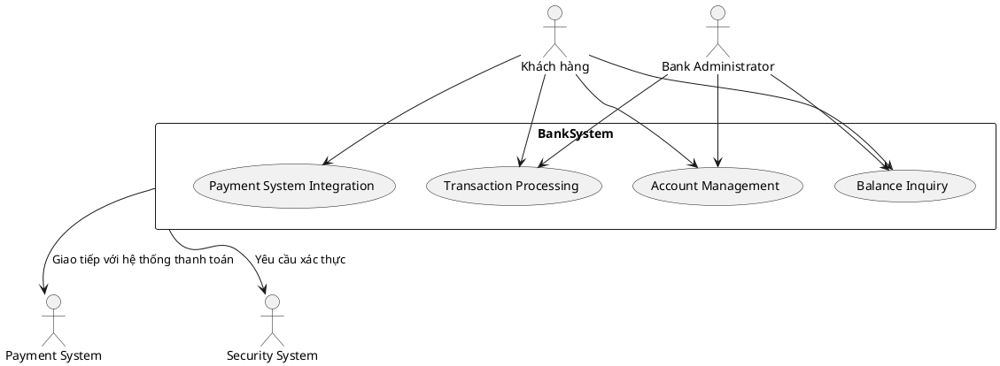

# 1. Các Phần Tử Chính Của Hệ Thống BankSystem

**BankSystem (Hệ thống ngân hàng)**: Đây là hệ thống chính, thực hiện các chức năng ngân hàng như quản lý tài khoản, xử lý giao dịch và cung cấp các dịch vụ ngân hàng trực tuyến.

### Các thành phần trong hệ thống BankSystem:
- **Account Management**: Quản lý tài khoản ngân hàng, bao gồm mở tài khoản, cập nhật thông tin tài khoản, và đóng tài khoản.
- **Transaction Processing**: Xử lý các giao dịch như chuyển tiền, rút tiền, nạp tiền, v.v.
- **Balance Inquiry**: Cho phép khách hàng kiểm tra số dư tài khoản của mình.
- **Customer Authentication**: Xác thực thông tin khách hàng khi thực hiện giao dịch.
- **Payment System Integration**: Kết nối với các hệ thống thanh toán bên ngoài để xử lý thanh toán hóa đơn, chuyển tiền quốc tế, v.v.

# 2. Các Tác Nhân (Actors) Bên Ngoài
- **Customer (Khách hàng)**: Người sử dụng dịch vụ ngân hàng để thực hiện các giao dịch như chuyển tiền, kiểm tra số dư tài khoản, thanh toán hóa đơn, v.v.
- **Payment System (Hệ thống thanh toán)**: Cung cấp các dịch vụ chuyển tiền hoặc thanh toán hóa đơn từ hệ thống ngân hàng đến các đối tác bên ngoài (ví dụ: hệ thống chuyển tiền quốc tế).
- **Security System (Hệ thống bảo mật)**: Xác thực và bảo vệ giao dịch của khách hàng trong hệ thống ngân hàng.
- **Bank Administrator (Quản trị viên ngân hàng)**: Quản lý và giám sát hoạt động của hệ thống ngân hàng, điều chỉnh quyền truy cập và thực hiện bảo trì hệ thống.

# 3. Các Mối Quan Hệ Giữa Các Tác Nhân Và Hệ Thống BankSystem
- Khách hàng tương tác với hệ thống BankSystem để thực hiện các giao dịch như kiểm tra số dư tài khoản, chuyển tiền, v.v.
- BankSystem tương tác với Payment System để xử lý các giao dịch thanh toán hoặc chuyển tiền ra ngoài hệ thống ngân hàng.
- BankSystem yêu cầu Security System xác thực các giao dịch để bảo mật và xác thực thông tin của khách hàng.
- Bank Administrator giám sát và quản lý hệ thống, bao gồm việc giám sát giao dịch và bảo trì hệ thống.

# 4. Biểu Đồ Ngữ Cảnh Của BankSystem Trong PlantUML

Đây là đoạn mã PlantUML mô tả biểu đồ ngữ cảnh của hệ thống BankSystem:

# 5. Giải Thích Biểu Đồ Ngữ Cảnh:

### Customer (Khách hàng):
Khách hàng yêu cầu các dịch vụ từ hệ thống BankSystem như kiểm tra số dư tài khoản, thực hiện giao dịch chuyển tiền, và thanh toán hóa đơn. Các chức năng này sẽ được quản lý bởi Account Management, Transaction Processing, và Balance Inquiry.

### BankSystem:
- **Account Management**: Quản lý tài khoản của khách hàng, bao gồm việc mở tài khoản, cập nhật thông tin và quản lý các giao dịch tài khoản.
- **Transaction Processing**: Quản lý và xử lý các giao dịch tài chính như chuyển tiền, rút tiền, thanh toán hóa đơn.
- **Balance Inquiry**: Cung cấp dịch vụ cho khách hàng để kiểm tra số dư tài khoản.
- **Payment System Integration**: Kết nối với các hệ thống thanh toán bên ngoài để thực hiện các giao dịch thanh toán hoặc chuyển tiền quốc tế.

### Payment System (Hệ thống thanh toán):
Hệ thống này giúp giao tiếp giữa hệ thống ngân hàng và các đối tác bên ngoài để xử lý các giao dịch thanh toán. Khi khách hàng thực hiện giao dịch thanh toán, hệ thống ngân hàng sẽ kết nối với Payment System để hoàn thành giao dịch.

### Security System (Hệ thống bảo mật):
Hệ thống bảo mật đảm bảo tính an toàn cho các giao dịch và xác thực người dùng khi họ truy cập và thực hiện các giao dịch trong hệ thống.

### Bank Administrator (Quản trị viên ngân hàng):
Quản trị viên ngân hàng có quyền truy cập và giám sát toàn bộ hệ thống. Họ quản lý tài khoản khách hàng, kiểm soát giao dịch, và đảm bảo hệ thống hoạt động ổn định.
# Ánh Xạ Các Lớp Phân Tích Đến Các Phần Tử Thiết Kế

Ánh xạ các lớp phân tích (analysis classes) đến các phần tử thiết kế (design elements) là một bước quan trọng trong quá trình phát triển phần mềm, giúp chuyển đổi các khái niệm từ giai đoạn phân tích sang giai đoạn thiết kế chi tiết. Dưới đây là một cách tiếp cận để thực hiện ánh xạ này.

## 1. Lớp Phân Tích (Analysis Classes)

Lớp phân tích thường được xác định trong giai đoạn phân tích yêu cầu và phản ánh các khái niệm hoặc đối tượng từ yêu cầu nghiệp vụ. Các lớp này chỉ ra các tính năng, các đối tượng trong hệ thống mà không quan tâm đến cách thức triển khai chi tiết.

Ví dụ về các lớp phân tích trong một **Bank System**:
- **Account**: Đại diện cho tài khoản ngân hàng của khách hàng.
- **Transaction**: Đại diện cho một giao dịch tài chính (chuyển tiền, rút tiền, v.v.).
- **Customer**: Đại diện cho khách hàng của ngân hàng.
- **Payment**: Đại diện cho các giao dịch thanh toán giữa các hệ thống.
- **BankSystem**: Hệ thống ngân hàng, quản lý các tài khoản, giao dịch và kết nối với các dịch vụ khác.

## 2. Phần Tử Thiết Kế (Design Elements)

Các phần tử thiết kế chi tiết hóa các lớp phân tích thành các thành phần thực thi trong hệ thống, bao gồm các lớp, mô-đun, giao diện, và các lớp hỗ trợ.

## 3. Ánh Xạ Các Lớp Phân Tích Đến Các Phần Tử Thiết Kế

### 1. **Account → Account Class**
- **Lớp phân tích**: `Account`
  - Các thuộc tính và phương thức trong lớp phân tích thường sẽ được chuyển thành các lớp thiết kế cụ thể.
- **Phần tử thiết kế**: `Account Class`
  - Các thuộc tính của tài khoản như `accountNumber`, `balance`, và `accountHolder` sẽ được triển khai trong lớp thiết kế.
  - Các phương thức như `deposit()`, `withdraw()`, `getBalance()` có thể được thiết kế như các phương thức trong lớp này.

### 2. **Transaction → Transaction Class**
- **Lớp phân tích**: `Transaction`
  - Mô tả các giao dịch như chuyển tiền, rút tiền.
- **Phần tử thiết kế**: `Transaction Class`
  - `Transaction` có thể có các thuộc tính như `transactionId`, `amount`, `date`.   Phương thức: `processTransaction()`, `validateTransaction()`.

### 3. **Customer → Customer Class**
- **Lớp phân tích**: `Customer`
  - Các thuộc tính và phương thức mô tả thông tin khách hàng.
- **Phần tử thiết kế**: `Customer Class`
  - `Customer` có thể có các thuộc tính như `customerId`, `name`, `email`, `phoneNumber`.
  - Các phương thức liên quan đến khách hàng như `updateInfo()`, `getAccountInfo()`.

### 4. **Payment → Payment System Integration**
- **Lớp phân tích**: `Payment`
  - Mô tả các giao dịch thanh toán, đặc biệt khi hệ thống cần tích hợp với các hệ thống thanh toán bên ngoài.
- **Phần tử thiết kế**: `Payment Service Class` hoặc `PaymentGateway`
  - Lớp thiết kế này có thể gọi các API từ bên ngoài, ví dụ như `sendPayment()`, `verifyPayment()`, và tích hợp với các hệ thống thanh toán qua giao diện (API) thiết kế.

### 5. **BankSystem → BankSystem Class**
- **Lớp phân tích**: `BankSystem`
  - Mô tả các chức năng chính của hệ thống ngân hàng.
- **Phần tử thiết kế**: `BankSystem Class`
  - Lớp thiết kế này sẽ chứa các phương thức như `manageAccount()`, `processTransaction()`, và `integratePayment()` để kết nối với các phần tử khác trong hệ thống.

## 4. Ví Dụ Minh Họa: Ánh Xạ Lớp Phân Tích Đến Các Phần Tử Thiết Kế trong Bank System

| **Lớp Phân Tích**    | **Phần Tử Thiết Kế**      | **Thuộc Tính và Phương Thức**                                                   |
|----------------------|---------------------------|--------------------------------------------------------------------------------|
| **Account**           | `Account Class`            | Thuộc tính: `accountNumber`, `balance`, `accountHolder`.   Phương thức: `deposit()`, `withdraw()`, `getBalance()`. |
| **Transaction**       | `Transaction Class`        | Thuộc tính: `transactionId`, `amount`, `date`.   Phương thức: `processTransaction()`, `validateTransaction()`. |
| **Customer**          | `Customer Class`           | Thuộc tính: `customerId`, `name`, `email`, `phoneNumber`.   Phương thức: `updateInfo()`, `getAccountInfo()`. |
| **Payment**           | `PaymentService Class`     | Phương thức: `sendPayment()`, `verifyPayment()`.   Tích hợp API thanh toán bên ngoài. |
| **BankSystem**        | `BankSystem Class`         | Phương thức: `manageAccount()`, `processTransaction()`, `integratePayment()`. |
